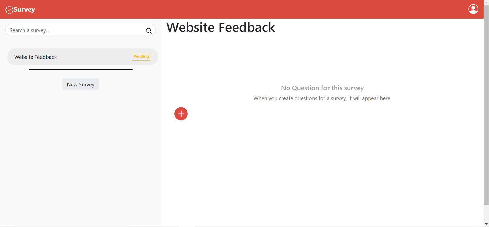
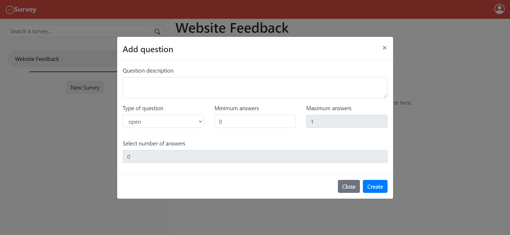
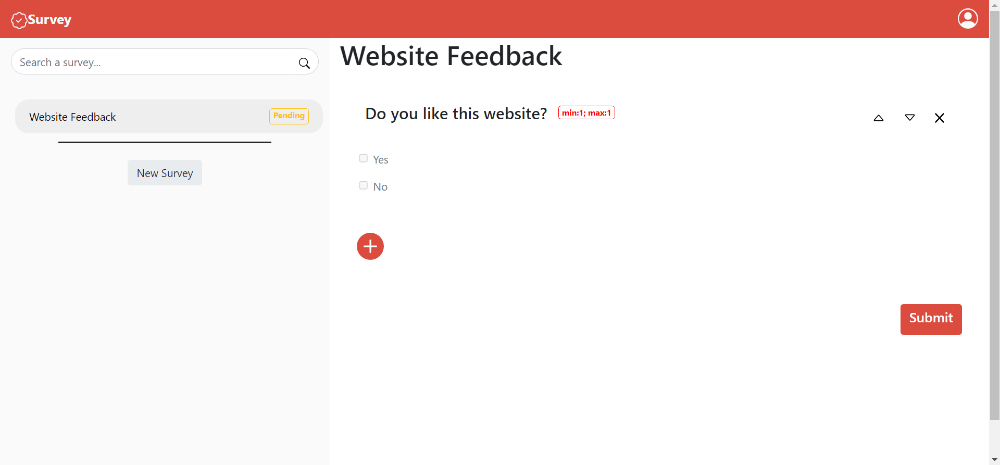

# Exam #1: "Survey"
## Student: s282380 CORALLO GIULIO

## React Client Application Routes

- Route `/`: redirect on the main page or on the admin page based if an admin is logged.
- Route `/main`: contains the main page, here a user can provide his name and start filling surveys or can logIn as administrator.
- Route `/login`: contains a page where the administrator can insert his username and password to authenticate.
- Route `/user`: contains the page of the user, after a user provide his name in the main page to start filling surveys, is redirected here. "UserPageEmpty" means an initial page with no survey selected yet.
- Route `/user/surveys/:id`: an user arrives in this route when he select a survey, "id" is the id of the survey selected.
- Route `/admin`: contains the page of the admin, after an admin authenticate himself, is redirected here. "AdminPageEmpty" mesn an initial page with no survey selected yet.
- Route `/admin/surveys/:id`: an admin arrives in this route when he select a survey, "id" is the id of the survey selected.
- Route `/admin/surveys/reports/:id`: if a survey is submitted and the admin select it (so he is in the route described above), he can select a user to show his report and consequently navigate among reports of others users. "id" is the id of the current user of that report.

## API Server

- GET `/api/surveys`
  - no parameters
  - contains an object described with an object "question" and an object "num" (number   of user that fill that survey)
- POST `/api/surveys`
  - no parameters body: title of the survey, submitted (0,1)
  - return the lastID
- GET `/api/surveys/:id`
  - id: id of the survey, no body
  - return an object composed: of an object "question" and  an array of object "answers", represent the closed    answer for a question
- POST `/api/surveys/question`
  - no parametres, body: question description, type of the question, minimum (0,1), maximum (0,1).
  - return the lastID
- POST `/api/surveys/:id`
  - id: id of the survey, body: answer description, question id
  - can return an error
- PUT `/api/surveys/setsubmitted/:id`
  - id: id of the survey, no body
  - return the id of the survey setted
- POST `/api/user/:name`
  - name: name of the user, no body
  - return the lastID
- GET `/api/surveys/submitted/:id`
  - id: id of the survey, no body
  - return the number of user that filled that survey
- GET `/api/surveys/submitted/listusers/:id`
  - id: id of the survey, no body
  - return an object containing the id of the user and his name
- GET `/api/surveys/submitted/user/:id&:surveyId`
  - id: id of the user, surveyId: id of the survey, no body
  - return an object containing an object "question" that describe a question and an array of object "answers" that describe the answers provided by an user
- GET `/api/surveys/submitted/user/answer/:id`
  - id: id of the answer, no body
  - return an object containg anserId and his description
- GET `/api/maxanswerid`
  - no parameters, no body
  - return the lastId of table answers
- GET `/api/maxquestionid`
  - no parameters, no body
  - return the lastId of table question
- GET `/api/maxsurveyid`
  - no parameters, no body
  - return the lastId of table surveys_admin
- POST `/api/user/surveys/:id`
  - id of the survey, body: questionId, answerId, userId
  - return nothing

  

## Database Tables

- Table `users` - contains id name 
- Table `surveys_user` - contains surveyId, questionId, answerid, userId, text (represent the answers provided by an user to a survey)
- Table `surveys_admin` - contains id, adminId, title, submitted (each row represent a survey of an admin)
- Table `surveys` - contains surveyId, questionId, answerId (represent the question and answers of a survey)
- Table `question` - contains id, description, type, minimum, maximum
- Table `answers` - contains id, description
- Table `administrators` - contains id, username, hash

## Main React Components

- `AdminPage` (in `AdminPageComponents.js`): represent a page of the admin with a survey select-> if this survey is submitted shows the list of users otherwise shows in the main content the possibility to add questions to a survey.
- `AdminPageEmpty` (in `AdminPageComponents.js`): represent a page of the admin with no survey selected: in the main content shows a message that no survey is selected yet, the sidebar and the navbar are the same of "AdminPage" (changes only the main content).
- `AdminPageReport` (in `AdminPageComponents.js`): shows in the main content the list of answers provided by a specific user, the sidebar and the navbar component are the same of "AdminPage" (changes only the main content).
- `LoginPage` (in `LoginPageComponents.js`): contain "LoginForm" component.
- `LoginForm` (in `LoginPageComponents.js`): contains the form with validation used by the admin to authenticate.
- `AdminMainContent` (in `MainContentComponents.js`): show the main content described in "AdminPage".
- `AdminMainContentEmpty` (in `MainContentComponents.js`): show the main content described in "AdminPageEmpty".
- `AdminMainContentReport` (in `MainContentComponents.js`): show the main content described in "AdminPageReport".
- `AddModal` (in `MainContentComponents.js`): contains the modal with validation to create a new question releted to a survey, is inside the "AdminMainContent" when the selected survey has submitted=0.
- `UserPage` (in `UserPageComponents.js`): represent a page of the user with a survey selected-> in the main content shows the question and the answers of that survey.
- `UserPageEmpty` (in `UserPageComponents.js`): represent a page of the user with no survey selected: in the main content shows a message that no survey is selected yet, the sidebar and the navbar are the same of "UserPage" (changes only the main content).
- `UserMainContent` (in `MainContentComponents.js`): show the main content described in "UserPage".
- `UserMainContentEmpty` (in `MainContentComponents.js`): show the main content described in "UserPageEmpty".
- `SurveySidebar & UserSidebar` (in `SidebarComponents.js`): represent respectively the Sidebar of the admin and the Sidebar of the user.
- `AddModal` (in `SidebarComponents.js`): contains the modal with validation to create a new question. This component is inside "SurveySidebar" component (admin side).
- `SurveyNavbar & UserNavbar & MainPageNavbar` (in `NavbarComponents.js`): represent respectively the Navbar of the admin, the Navbar of the user(with no "UserLogo") and the Navbar of the main page.
- `MainPage` (in `StartPageComponents.js`): represent a page of the main page. contains the MainPageNavbar described above and a Row with two columns, on the left there is a Form and a Button where an user can fill it, on the right there is an image(I took it from Google Images).

(only _main_ components, minor ones may be skipped)

## Screenshot

### Select a Survey

### Create a Question

## Users Credentials

- username: giovanni, password: password
- username: marco, password: password
